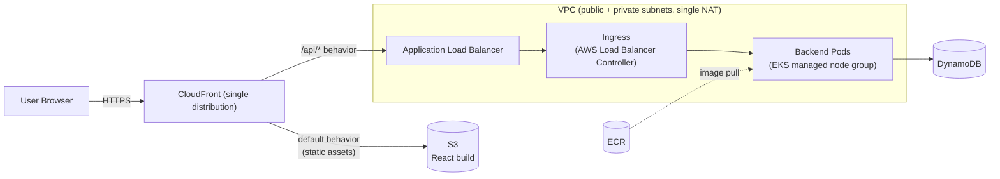

# EKS Full-Stack Platform

Infrastructure-as-Code and application stack that runs a **Node.js API** and a **React single-page app** on **Amazon EKS**, provisioned entirely with **Terraform**. The frontend is served globally through **CloudFront + S3**; the API runs as containers on EKS behind an **Application Load Balancer**; state lives in **DynamoDB**; container images are stored in **ECR**.

The Terraform is organised into small, reusable **modules** consumed by thin **per-environment, per-component** layers, each with its own remote state, so components can be planned, applied, and destroyed independently.

---

## Architecture



### Request flow

- The browser talks to **one hostname**, the CloudFront distribution, over HTTPS.
- CloudFront routes by URL path:
  - **`/api/*`** → forwarded to the **ALB** origin (no caching) → Kubernetes `Ingress` → backend pods → DynamoDB.
  - **everything else** → served from the private **S3** origin (the React build), cached at the edge.
- Because both origins sit behind the same distribution, the app calls a **relative `/api`**, no CORS, no mixed content, one TLS certificate.

### Why each service

| Service | Role |
|---|---|
| **EKS** | Runs the containerised backend (managed node group; addons: CoreDNS, kube-proxy, VPC CNI, Pod Identity agent). |
| **AWS Load Balancer Controller** | Provisions and reconciles the ALB from Kubernetes `Ingress` objects. |
| **DynamoDB** | Application data store (composite `pk`/`sk` key, on-demand billing, PITR, TTL, a GSI). |
| **S3** | Private origin holding the React static build. |
| **CloudFront** | Global CDN + single HTTPS front door unifying the static site and the API. |
| **ECR** | Private registry for the backend image. |
| **IAM (EKS Pod Identity)** | Scoped, keyless credentials delivered to pods (no static access keys). |

---

## Repository layout

```
eks-fullstack-platform/
├── terraform/
│   ├── modules/                 # Reusable, environment-agnostic modules
│   │   ├── networking/          # VPC, subnets, NAT, subnet tags
│   │   ├── eks/                 # EKS cluster, node groups, addons
│   │   ├── dynamodb/            # DynamoDB table
│   │   ├── ecr/                 # Container registry
│   │   ├── s3/                  # Frontend bucket (private)
│   │   ├── lb-controller/       # ALB controller IAM + Helm release
│   │   └── cloudfront/          # Distribution + OAC + bucket policy
│   └── environment/
│       └── staging/             # Thin per-component layers (each = its own state)
│           ├── networking/
│           ├── eks/
│           ├── database/        # -> dynamodb
│           ├── compute/         # -> ecr
│           ├── storage/         # -> s3
│           ├── lb-controller/
│           ├── backend-iam/     # Pod-identity role scoped to the table
│           └── cloudfront/
├── backend/                     # Node.js + Express API (AWS SDK v3)
├── frontend/                    # React + Vite SPA
└── deploy/                      # Kubernetes manifests (namespace, SA, deploy, svc, ingress)
```

---

## Terraform design principles

- **Layered state by lifecycle.** Components are grouped by change cadence (networking / compute / storage / database / platform) and each gets its **own state file** in S3. The state boundary is the blast-radius boundary: a routine app change never re-plans the VPC, and a failed apply is contained to one component.
- **Reusable modules + thin environment layers.** `modules/*` are environment-agnostic; `environment/staging/*` wire them together, supply variables, and own the backend + provider config. No hardcoded values in modules.
- **Cross-component wiring via `terraform_remote_state`.** Computed dependencies (VPC ID, subnet IDs, table ARN, bucket domain, ALB DNS) flow between components through remote state; `*.tfvars` is reserved for human-chosen config.
- **Native S3 state locking** (`use_lockfile = true`), no separate DynamoDB lock table.
- **EKS Pod Identity over IRSA** for workload IAM, no OIDC trust wiring, no static keys.
- **Least-privilege IAM**, the backend role is scoped to a single table and its indexes, not `dynamodb:*` on `*`.
- **ALB provisioned by Kubernetes, not Terraform**, declaring an `Ingress` creates the load balancer; its lifecycle is owned by the controller.
- **Cost-aware staging**, single NAT gateway, on-demand DynamoDB, one small managed node group.

---

## Prerequisites

- An AWS account and an existing **S3 bucket for Terraform state** (referenced in each component's `backend "s3"` block).
- Terraform **>= 1.13**, AWS provider **~> 6.0**
- AWS CLI v2, `kubectl`, Docker, Node.js **>= 18** (for the frontend build)
- An IAM identity with permissions to create the resources above.

> Account IDs, the state bucket name, and region are environment-specific. Substitute your own values in the `providers.tf` backend blocks and any hardcoded ARNs before deploying.

---

## Deployment order

Terraform components (run `terraform init && terraform apply` in each):

1. `environment/staging/networking`
2. `environment/staging/eks`
3. `environment/staging/database`
4. `environment/staging/compute` (ECR)
5. `environment/staging/storage` (S3)
6. `environment/staging/lb-controller`
7. `environment/staging/backend-iam`

Application:

8. **Configure kubectl:** `aws eks update-kubeconfig --name eks-infra-staging --region us-east-1`
9. **Build & push the backend image** to ECR (see `backend/`).
10. **Deploy to the cluster:** `kubectl apply -f deploy/backend.yaml`, the `Ingress` provisions the ALB.
11. **Build & upload the frontend:** `npm --prefix frontend install && npm --prefix frontend run build && aws s3 sync frontend/dist/ s3://<bucket> --delete`
12. `environment/staging/cloudfront` (last, it discovers the ALB and fronts both origins)

CloudFront is intentionally last because it needs the ALB (created by the Ingress) as its `/api/*` origin.

### Verify

```bash
# API directly through the ALB
ALB=$(kubectl get ingress backend -n app -o jsonpath='{.status.loadBalancer.ingress[0].hostname}')
curl http://$ALB/api/healthz

# Full path through CloudFront (after the distribution deploys)
terraform -chdir=terraform/environment/staging/cloudfront output cloudfront_url
```

Open the CloudFront URL: the React app loads, and creating an item round-trips through `/api` → ALB → EKS → DynamoDB.

---

## Application

- **`backend/`**, Express API using AWS SDK v3. Routes: `GET /api/healthz`, `GET /api/items`, `POST /api/items`. Credentials come from EKS Pod Identity; `AWS_REGION` and `TABLE_NAME` are injected via env. Containerised with `node:20-alpine`.
- **`frontend/`**, React + Vite SPA that calls a relative `/api`. Built to static assets and synced to S3.
- **`deploy/backend.yaml`**, `Namespace`, `ServiceAccount` (bound to the pod-identity association), `Deployment`, `Service`, and an ALB `Ingress`.

---

## Teardown

Destroy in reverse dependency order:

```
cloudfront -> (kubectl delete -f deploy/backend.yaml)  # removes the ALB
           -> lb-controller -> backend-iam
           -> storage -> compute -> database
           -> eks -> networking
```

Destroying the EKS cluster and NAT gateway is what stops the majority of ongoing cost.

---

## Possible improvements

- Custom domain: Route 53 + ACM certificate + CloudFront alternate domain name.
- Lock the ALB security group to CloudFront's managed prefix list; add WAF on the distribution.
- Autoscaling: Cluster Autoscaler / Karpenter and HPA for the backend.
- CI/CD pipeline for image build/push and `terraform plan/apply`.
- Promote `staging` to a reusable pattern for additional environments (`prod`, etc.).
